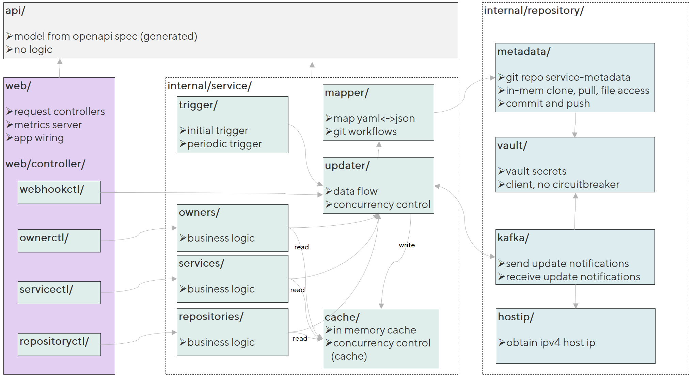

[](../../actions/workflows/go.yaml)
[][release]
[][release]
[][swagger]
[](https://codecov.io/gh/interhyp/metadata-service)
[](https://github.com/semantic-release/semantic-release)

# Metadata Service

The metadata-service is a [fifteen factor][15-factor] microservice that uses the [GitOps][gitops] pattern to manage
metadata (owner, reviewers, quicklinks, alerting targets, ...) about services and exposes it via [its REST API][swagger]
. It uses the [following repository][template] as a data store. Create a copy of it by hitting
the [][use-template] button.

## Getting Started

> ⚠ The service requires a [Vault][vault] instance to get the secrets required for committing changes into
> the [metadata-repository][template].

1. Download the [latest release][release] or clone the repository to build a local [Docker image][docker].
2. Copy the config from [`local-config.template.yaml`][config] as `local-config.yaml`
3. Adjust the config and fill in all required values (see below for details)
4. Create a copy of the [template repository][template] and set it in the `local-config.yaml`
5. Run the server by starting the binary

## Configuration

In production all configuration is sourced from environment variables. For localhost development
the [`local-config.yaml`][config] can be used to set the variables.

| Variable                           | Default                                               | Description                                                                                                                                                                                                              |
|------------------------------------|-------------------------------------------------------|--------------------------------------------------------------------------------------------------------------------------------------------------------------------------------------------------------------------------|
| `APPLICATION_NAME`                 | `metadata`                                            | The name of the application, lowercase, numbers and - only.                                                                                                                                                              |
| `SERVER_ADDRESS`                   | `0.0.0.0`                                             | Address to bind to, one of IP, Hostname, ipv6_ip, ipv6ip%interface                                                                                                                                                       |
| `SERVER_PORT`                      | `8080`                                                | Port to listen on, cannot be a privileged port. Must be in range of 1024 - 65535.                                                                                                                                        |
| `METRICS_PORT`                     | `9090`                                                | Port to provide prometheus metrics on, cannot be a privileged port. Must be in range of 1024 - 65535.                                                                                                                    |
|                                    |                                                       |                                                                                                                                                                                                                          |
| `METADATA_REPO_URL`                |                                                       | The HTTP url to the repository containing the metadata. e.g.: `https://github.com/Interhyp/metadata-service-template.git`                                                                                                |
| `METADATA_REPO_MAINLINE`           | `refs/heads/main`                                     | The ref of the service metadata used as mainline                                                                                                                                                                         |
| `OWNER_REGEX`                      | `.*`                                                  | The regex used to limt owner aliases to load. Mostly useful for local development to minimize startup time. Default loads all owners.                                                                                    |
|                                    |                                                       |                                                                                                                                                                                                                          |
| `LOGSTYLE`                         | `ecs`                                                 | The logstyle to use (defaults to [elastic common schema][ecs]) and can be changed to `plain` for localhost debugging.                                                                                                    |
|                                    |                                                       |                                                                                                                                                                                                                          |
| `VAULT_ENABLED`                    | `true`                                                | Enables vault. supports all values supported by [ParseBool][https://pkg.go.dev/strconv#ParseBool].                                                                                                                       |
| `VAULT_SERVER`                     |                                                       | FQDN of the [Vault][vault] server - do not add any other part of the URL.                                                                                                                                                |
| `VAULT_AUTH_TOKEN`                 |                                                       | Authentication token used to fetch secrets. Setting this implicitly switches from [Kubernetes authentication][vault-k8-auth] to [token mode][vault-token-auth].                                                          |
| `VAULT_AUTH_KUBERNETES_ROLE`       |                                                       | Role binding to use for vault kubernetes authentication, usually <PLATFORM>_microservice_role_<APPNAME>_<ENVIRONMENT>                                                                                                    |
| `VAULT_AUTH_KUBERNETES_TOKEN_PATH` | `/var/run/secrets/kubernetes.io/serviceaccount/token` | File path to the service-account token.                                                                                                                                                                                  |
| `VAULT_AUTH_KUBERNETES_BACKEND`    |                                                       | Authentication path for the kubernetes cluster.                                                                                                                                                                          |
| `VAULT_SECRETS_CONFIG`             |                                                       | Configuration consisting of vault paths and keys to fetch from the corresponding path. Values will be written to the global configuration object.                                                                        |
|                                    |                                                       |                                                                                                                                                                                                                          |
| `BASIC_AUTH_USERNAME`              |                                                       | Name of the user used for basic authentication to this service. User will be granted admin privileges.                                                                                                                   |
| `BASIC_AUTH_PASSWORD`              |                                                       | Password of the user used for basic authentication to this service. User will be granted admin privileges.                                                                                                               |
|                                    |                                                       |                                                                                                                                                                                                                          |
| `BITBUCKET_USERNAME`               |                                                       | Name of the user used for basic git authentication to pull and update the metadata repository.                                                                                                                           |
| `BITBUCKET_PASSWORD`               |                                                       | Password of the user used for basic git authentication to pull and update the metadata repository.                                                                                                                       |
| `PULL_REQUEST_BUILD_URL`           |                                                       | Url to link to on pull request builds. Should probably be the public URL of this service.                                                                                                                                |
| `PULL_REQUEST_BUILD_KEY`           | `metadata-service`                                    | Key for pull request builds on pull requests in the underlying git repository. Changed files are syntactically validated.                                                                                                |
|                                    |                                                       |                                                                                                                                                                                                                          |
| `GIT_COMMITTER_NAME`               |                                                       | Name of the user used to create the Git commits.                                                                                                                                                                         |
| `GIT_COMMITTER_EMAIL`              |                                                       | E-Mail of the user used to create the Git commits.                                                                                                                                                                       |
|                                    |                                                       |                                                                                                                                                                                                                          |
| `KAFKA_TOPICS_CONFIG`              |                                                       | A Json configuration for a Kafka Topic to publish updates to. Leave empty to skip the Kafka integration. See below for details and an example.                                                                           |
| `KAFKA_GROUP_ID_OVERRIDE`          |                                                       | Override the kafka group id for local development to avoid creating lots of consumer groups. If unset, derived from local IP address so each k8s pod gets their own group.                                               |
|                                    |                                                       |                                                                                                                                                                                                                          |
| `AUTH_OIDC_KEY_SET_URL`            |                                                       | URL to the [OpenID Connect Keyset][openid] for validating JWTs. See [authentication](#authentication) for more details.                                                                                                  |
| `AUTH_OIDC_TOKEN_AUDIENCE`         |                                                       | Expected audience of the JWT. Tokens not created for this audience will be rejected.                                                                                                                                     |
| `AUTH_GROUP_WRITE`                 |                                                       | Id or name of the group that is allowed to perform write actions. Needs to be part of the 'groups' claim to perform successful requests. If left blank, anyone with a valid JWT is allowed to perform write actions.     |
|                                    |                                                       |                                                                                                                                                                                                                          |
| `UPDATE_JOB_INTERVAL_MINUTES`      | `15`                                                  | Interval in minutes for refreshing the metadata repository cache.                                                                                                                                                        |
| `UPDATE_JOB_TIMEOUT_SECONDS`       | `30`                                                  | Timeout in seconds when fetching the Git repository.                                                                                                                                                                     |
|                                    |                                                       |                                                                                                                                                                                                                          |
| `ALERT_TARGET_REGEX`               |                                                       | Validates the alert target to match the regular expression.                                                                                                                                                              |
|                                    |                                                       |                                                                                                                                                                                                                          |
| `OWNER_ALIAS_PERMITTED_REGEX`      | `^[a-z](-?[a-z0-9]+)*$`                               | Regular expression to control the owner aliases that are permitted to be be created.                                                                                                                                     |
| `OWNER_ALIAS_PROHIBITED_REGEX`     | `^$`                                                  | Regular expression to control the owner aliases that are prohibited to be be created.                                                                                                                                    |
| `OWNER_ALIAS_MAX_LENGTH`           | `28`                                                  | Maximum length of a valid owner alias.                                                                                                                                                                                   |
| `OWNER_ALIAS_FILTER_REGEX`         |                                                       | Regular expression to filter owners based on their alias. Useful on localhost or for test instances to speed up service startup.                                                                                         |
|                                    |                                                       |                                                                                                                                                                                                                          |
| `SERVICE_NAME_PERMITTED_REGEX`     | `^[a-z](-?[a-z0-9]+)*$`                               | Regular expression to control the service names that are permitted to be be created.                                                                                                                                     |
| `SERVICE_NAME_PROHIBITED_REGEX`    | `^$`                                                  | Regular expression to control the service names that are prohibited to be be created.                                                                                                                                    |
| `SERVICE_NAME_MAX_LENGTH`          | `28`                                                  | Maximum length of a valid service name.                                                                                                                                                                                  |
|                                    |                                                       |                                                                                                                                                                                                                          |
| `REPOSITORY_NAME_PERMITTED_REGEX`  | `^[a-z](-?[a-z0-9]+)*$`                               | Regular expression to control the repository names that are permitted to be be created.                                                                                                                                  |
| `REPOSITORY_NAME_PROHIBITED_REGEX` | `^$`                                                  | Regular expression to control the repository names that are prohibited to be be created.                                                                                                                                 |
| `REPOSITORY_NAME_MAX_LENGTH`       | `64`                                                  | Maximum length of a valid repository name.                                                                                                                                                                               |
| `REPOSITORY_TYPES`                 |                                                       | Comma separated list of supported repository types.                                                                                                                                                                      |
| `REPOSITORY_KEY_SEPARATOR`         | `.`                                                   | Single character used to separate repository name from repository type. repository name and repository type must not contain separator.                                                                                  |
|                                    |                                                       |                                                                                                                                                                                                                          |
|                                    |                                                       |                                                                                                                                                                                                                          |
| `REDIS_URL`                        |                                                       | Url to an optional Redis instance to use as a shared cache. Will use in-memory cache if left blank                                                                                                                       |
| `REDIS_PASSWORD`                   |                                                       | Password for the Redis instance. Can be read from Vault via `VAULT_SECRETS_CONFIG`                                                                                                                                       |
| `VCS_CONFIGS`                      |                                                       | A Json configuration for a VCS to add pull request validation build status and comment to. Leave empty to skip the VCS integration. Supportet VCS GitHub and Bitbucket Datacenter. See below for details and an example. |
| `WEBHOOKS_PROCESS_ASYNC`           |                                                       | Webhooks handler is working asynchronously/synchronously.                                                                                                                                                                |
| `USER_PREFIX`                      |                                                       | Prefix for usernames, in case usernames in the VCS has a prefix that is not part of usernames in yaml files.                                                                                                             |

## Datastore

The metadata-service uses a Git repository as [its datastore][template] and caches it in memory. This enables
a [GitOps][gitops] pattern for maintaining the metadata of services. The metadata is categorized into the three
types `owner`, `service` and `repository`. The structure of the repository is as follows. See
the [][swagger]
documentation for details on the API.

```
owners/
└── owner-a/
    ├── owner.info.yaml
    ├── services/
    │   ├── service-a.yaml
    │   └── service-b.yaml
    └── repositories/
        ├── service-a.implementation.yaml
        ├── service-a.deployment.yaml
        ├── service-b.api.yaml
        └── something.none.yaml
```

## Authentication

The metadata-service has two kinds of authentication. One for the repository used as the [datastore](#datastore) and
another set of credentials used to authenticate against the protected API (create, update, delete operations) of the
service.

### Datastore Authentication

The service currently only supports Basic Authentication for fetching and updating the git repository used as
the [datastore](#datastore). The credentials are configured via `BITBUCKET_USERNAME` and `BITBUCKET_PASSWORD` which are
either
provided as environment variable or via [Vault][vault] using the same keys at the destination defined in
`VAULT_SERVICE_SECRETS_PATH`.

### API Authentication

Authentication against the API of the metadata-service can be done using a JWT and configuring the `KEY_SET_URL`
with a valid [OpenID][openid] backend. As an alternative Basic Authentication can be enabled to authorise requests to
your API.
The credentials are configured via `BASIC_AUTH_USERNAME` and `BASIC_AUTH_PASSWORD` which are either
provided as environment variable or via [Vault][vault] using the same keys at the destination defined in
`VAULT_SERVICE_SECRETS_PATH`.

> **WARNING**  
> Leaving `BASIC_AUTH_USERNAME` and `BASIC_AUTH_PASSWORD` empty will currently expose your protected API to anonymous
> requests.

## concurrency and eventual consistency

You will notice that all read operations give you the timestamp and git commit hash. You are expected to send this
back to us when making an update. We use this to detect concurrent updates.

Many parts of the api will give you a 409 response if you attempt to update based on outdated information
(commit hash).

While an update is being distributed between instances, we make **no strong consistency guarantees for read operations**
.

Write operations, on the other hand, always pull the current git tree before committing, and since you are
sending along the commit hash and timestamp an update is based on, any concurrent updates will fail
even if they happen to go through different instances of this service.

_This has an important consequence! If you make a write operation, and you want to continue working with
a metadata entry, then you must always use the new state returned by the write operation to continue working with
an entry, or you may end up on another instance and read old state._

All write operations, including PATCH and initial creation, return the current state of the metadata entry,
including the new timestamp and commit hash.

### changing owners

You can **change the owner of a service** by making an update to it that changes the owner alias. This will also
change the owner of any repositories associated with the service, and the whole thing is done in a single git
commit, meaning, this is an atomic operation.

It is not valid to change the owner of a repository directly while its service references it, because that
would lead to dangling references in the service. Change the owner of the service instead.

_Note: this microservice only changes the metadata in git. You will still need to make other changes, such as moving
Jenkins jobs._

You can also **change the owner of a repository** (except for service-associated repositories) by making
an update to it that changes the owner alias. This is an atomic operation which will result in a single
git commit.

## kafka event stream and caching behaviour

Kafka update notifications are sent for changes received through a controller (including the webhook controller,
which needs to be configured in Bitbucket to notify the service of outside changes).

This may lead to duplicate update notifications, both in and out of order. We solve this by keeping track of
which commits in service-metadata we have already seen, and ignoring those events. Any event that has a new
commit hash leads to a synchronous pull and update of all caches, and the next time that commit will be known.

_If you are a client subscribing to our Kafka update notifications, and you want to ensure you GET the current
state following an update notification, you must compare the commit hash and timestamp to see if you got the
correct version. If not, wait a bit and try again, you landed on an instance that isn't consistent yet._

### Kafka configuration

If you wish to use a Kafka topic, set the environment variable `KAFKA_TOPICS_CONFIG` to a JSON document
as follows (displayed in prettyprinted form for readability):

```
{
    "metadata-change-events": {
        "topic": "metadata-change-events",
        "brokers": [
          "kafka-seed-broker1.example.com:9092",
          "kafka-seed-broker2.example.com:9092"
        ],
        "username": "<username used to connect>",
        "passwordEnvVar": "METADATA_CHANGE_EVENTS_PASSWORD",
        "authType": "PLAIN"
    }
}
```

This assumes of course that the password is provided in the specified environment variable. On Localhost, you
can simply set "password" in the JSON.

AuthType sets the SASL authentication method, possible values are `PLAIN`, `SCRAM-SHA-256`, `SCRAM-SHA-512`.

Note: You can use the Vault integration configuration to read the password from Vault by including it in
`VAULT_SECRETS_CONFIG`, similar to:

```
   [...]
    "some/vault/path": [
      {"vaultKey": "METADATA_CHANGE_EVENTS_PASSWORD"}
    ],
```

## VCS configuration

If you wish to use pull request validation with your VCS (Bitbucket Datacenter, GitHub), set the environment variable
`VCS_CONFIGS` to a JSON document
as follows (displayed in prettyprinted form for readability):

```
  {
    "github": {
      "platform": "GITHUB",
      "apiBaseURL": "https://api.github.com",
      "accessTokenEnvVar": "GITHUB_ACCESS_TOKEN"
    }
  }
```

This assumes of course that the password is provided in the specified environment variable. On Localhost, you
can simply set "password" in the JSON.

Note: You can use the Vault integration configuration to read the password from Vault by including it in
`VAULT_SECRETS_CONFIG`, similar to:

```
   [...]
    "some/vault/path": [
      {"vaultKey": "GITHUB_ACCESS_TOKEN"}
    ],
```

## architecture



## development

### initial setup

Clone this outside your GOPATH (on linux, defaults to ~/go)

_Tip: On Windows, you should NOT place the GOPATH in your profile, because a large body of source code goes there._

### generate api model classes

**The generated models are checked in, so you only need to run this step if there is a change in the openapi specs.**

We use the [OpenAPI Generator](https://openapi-generator.tech) to generate our model classes (and only those!)

In a git bash (or on Linux), run `./api-generator/generate.sh`.

### build

`go build main.go`

### run tests

We have _given-when-then_ style acceptance tests.

Run all tests, including the acceptance:

`go test -coverpkg='./internal/...' -v './...'`

In IntelliJ/GoLand, if you want to check code coverage, you must set Go Tool Arguments to
`-coverpkg='./internal/...'`,
so cross-package coverage from the acceptance tests is considered. You may wish to set this under
Edit Configuration - Edit Configuration Templates, so it will be set on all new test run configurations.

Clear the test cache:

`go clean -testcache`

### Goland terminal configuration

Goland has the annoying habit of limiting line width on the output terminal to 80 characters no matter how wide the
window is. You can fix this. Menu: Help -> Find Action... -> search for "Registry"

Uncheck `go.run.processes.with.pty`.

### run application

All configuration is normally read from **environment variables**, but for localhost convenience, we support an
optional flat yaml file called `local-config.yaml`, which is ignored by git.
If present, it is read BEFORE any environment variables are interpreted.

Copy the [`local-config.template.yaml`](local-config.template.yaml) and replace `LOCAL_VAULT_TOKEN` with your
Vault token.

To obtain your personal vault token, log into vault, and use "Copy token" from the
user menu on the right. Then add this verbatim under `LOCAL_VAULT_TOKEN`.

After this, the application can be started with:

`go run main.go`

### use Elastic APM during local development

To use Elastic APM add the following environment to your (run) configuration:

`ELASTIC_APM_SERVER_URL=https://apm-server.sys.ehyp.dev.interhyp-cloud.de;ELASTIC_APM_ENVIRONMENT=dev;ELASTIC_APM_SERVICE_NAME=metadata`

To disable APM, even if it is configured, add `ELASTIC_APM_DISABLED: true` to your `local-config.yaml`.

### swagger-ui

This service comes with the swagger ui built-in.

Open http://localhost:8080/swagger-ui/index.html in your browser.

The api docs URL is /v3/api-docs (in case the swagger ui does not automatically open it).

### working with GitHub webhooks

[GitHub webhooks forwarding documentation](https://docs.github.com/en/webhooks/testing-and-troubleshooting-webhooks/using-the-github-cli-to-forward-webhooks-for-testing)

e.g: `gh webhook foward --repo=<YOUR_ORGANIZATION>/<YOUR_REPOSITORY> --url=http://localhost:8080/webhooks/vcs/github --events=pull_request,push`

### List dependency tree

`go mod graph > deps.txt`

[15-factor]: https://domenicoluciani.com/2021/10/30/15-factor-app.html

[gitops]: https://about.gitlab.com/topics/gitops/

[swagger]: https://interhyp.github.io/metadata-service/

[template]: https://github.com/Interhyp/metadata-service-template/

[use-template]: https://github.com/Interhyp/metadata-service-template/generate

[release]: ../../releases/latest

[docker]: Dockerfile

[config]: docs/local-config.template.yaml

[vault]: https://www.vaultproject.io/

[vault-k8-auth]: https://www.vaultproject.io/docs/auth/kubernetes

[vault-token-auth]: https://www.vaultproject.io/docs/auth/token

[ecs]: https://www.elastic.co/guide/en/ecs/current/index.html

[openid]: https://github.com/dexidp/dex